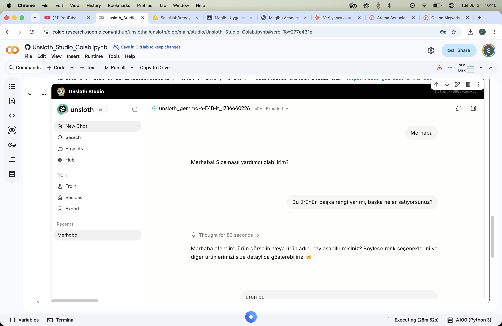
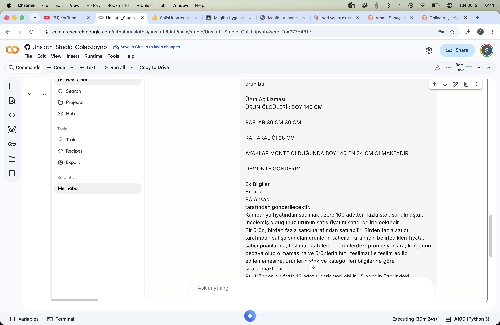
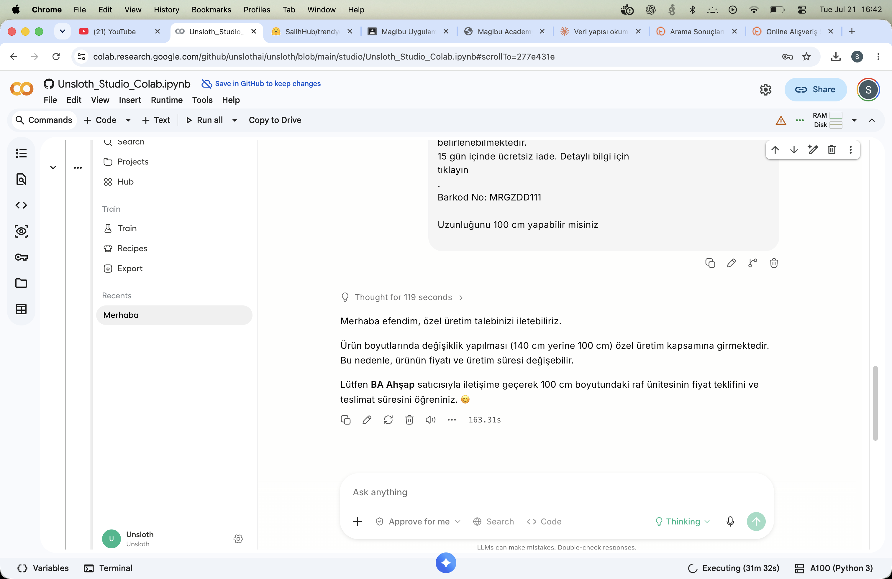

# magibu-work
Magibu Eğitim Notları ve Ödevleri

## Ders1 : Ödevlendirmeler Ders1>HW altında mevcuttur.
- Ödev 1 : Türkiye şehirleri üzerine modelleri eğittim ve eğitim çıktılarını elde ettim ".pt" dosyalarını ve de girdi txt dosyasını HW altında models klasöründe bulabilirsiniz düzenli durması için eklenmiştir.

- Ödev 2 : Atilla İlhan'ın 2 adet şiirini kullanarak BPE yaklaşımıyla bir tokenizer eğittim. Süreç jupiter notebook olarak tutuldu ve çıktı dısyası **bpe_tokenizer_512** altında mevcuttur.

## Ders2 : Ödevlendirmeler Ders2 altında mevcuttur
- Ödev 1 : Selenium kullanılarak basit bir trendyol ürün bilgisi çeken ve satıcıya sorulan soru ve cevapları scrapleyen bir otomasyon yazıldı ve 1211 qa çifti toplandı. LLM ile suni olarak input - output iletişimine ve ürün detaylarına bakarak thinking bloğu suni bir şekilde dolduruldu ve dataset oluşturuldu.
HF Linki : https://huggingface.co/datasets/SalihHub/trendyol-marangoz-urun-asistan-qa

- Ödev 2 : Nutuk, Jules Verne : Ay'a yolculuk ve Denizler Altında 20 bin fersah kitapları üzerinden 256k olacak şekilde koşuldu ancak byte eşleşmesi daha erken durduğu için 256k ya ulaşmadan sonuçlandı ve HF'e eklendi.
HF Link : https://huggingface.co/SalihHub/turkce-edebiyat-bpe-tokenizer-256k

Ödev 3 : Unsloth üzerinden direkt ui olarak derlendi ve arayüzden gemma 4 - E4B - it modeli elde edilen Ödev 1 dataseti ile Qlora 4 bit kullanıralarak finetune edildi.

HF Link : https://huggingface.co/SalihHub/trendyol-marangoz-finetuned-gemma-4-E4B-it

Modelin bazı davranışları

-----------

-----------

